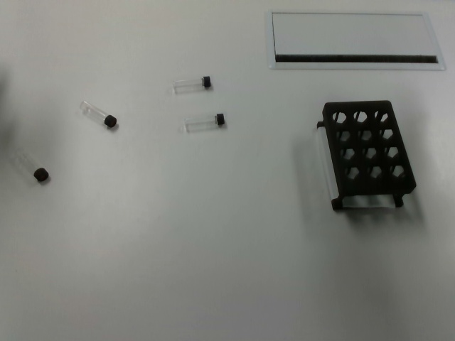

# Franka 双臂“抓取—交接—插入试管架”Demo 操作说明

本文档用于现场演示：机器人先识别桌面上的全部试管和试管架，操作者确认识别结果后按 Enter，程序按照试管在初始图像中的从左到右顺序，自动完成抓取、双臂交接、插入试管架、释放和回撤。

> 真机操作具有风险。开始前确认急停可用，工作区域没有人员、杂物或可能被夹住的物体。首次运行或更换摆放方式时，建议保留程序的 Enter 确认，不要使用 `--no-wait-before-motion`。

## 一、Franka 上电与 Desk 初始化

1. 给左右两台 Franka 上电。

2. 等待机器人指示灯刷新为白灯，确认控制柜和机器人网络已经起来。

3. 在浏览器中分别打开：

   - `http://172.16.0.1`
   - `http://172.16.0.2`

   进入两台机器对应的 Franka Desk 页面。

4. 在 Franka Desk 中分别完成：

   - 解锁机器人（Unlock Joints）。
   - 开启 FCI 控制（Activate FCI）。

   两台机器人都完成后，再继续下面的 ROS2 启动步骤。若 Desk 仍显示锁定、错误或 FCI 未启动，不要继续运行真机程序。

## 二、启动双臂 ROS2 控制

另开一个终端，SSH 登录机器人主机：

```bash
ssh owen@prime-u7-03
cd ~/franka_dual_ros2
source install/setup.bash
ros2 launch exp_env_interact dual_franka_robotiq_bringup.launch.py
```

保持这个终端持续运行，不要关闭。正常情况下可以看到双臂 Franka 和 Robotiq 控制节点启动，后续机器人 RPC 服务应能正常响应。

## 三、启动前测试 robot-reset 和夹爪

在本机另开一个终端运行 reset。这里不需要 SSH 到 `prime-u7-03`：

```bash
conda activate dual_arm_data
cd ~/Le-nero/dual_arm_teleop
robot-reset --config scripts/config/record_cfg.yaml
```

预期结果：

```text
Resetting robot to home position...
Robot reset completed successfully.
```

同时观察左右 Robotiq 夹爪是否有响应，并确认两只机械臂回到 Home 附近。若 reset 失败、夹爪没有反应、ROS2 bringup 已退出或机器人状态异常，应停止 Demo，先处理控制链路问题。

## 四、摆放试管和试管架

### 4.1 推荐参考摆放

下面是一次完整成功运行的现场照片：4 支试管和黑色试管架均被成功识别并完成抓取、交接和插入。照片来自运行记录：
`/tmp/agentic_skills_runs/full_pick_tube_insert_rack_20260806_120132`，结果为 `grasp_failures=0`、`insertion_failures=0`。



图中黑色盖子一端为试管头部。摆放时参照以下原则：

- 试管架放在相对固定、平整的位置，优先放在相机能完整看到的位置。
- 试管头部统一朝向右臂一侧；不要让试管头朝向相反方向或被其他试管遮挡。
- 试管之间要留出明显间距，不能相互接触、重叠或遮挡。建议至少留出约 3—5 cm，现场以相机能够分割出每支试管完整轮廓为准。
- 试管不要贴近试管架、桌面边缘、墙面或其他障碍物，避免机械臂接近和抓取时发生碰撞。
- 试管尽量平放，避免交叉堆叠；四支试管按大致左到右分散摆放，便于识别和后续执行。
- 试管架的孔位和长轴要清晰可见，不要被试管、手或其他物体遮挡。

程序会按初始图像中试管中心的 X 坐标从左到右确定执行顺序。执行顺序的左右与具体使用哪只手不是同一个规则：当前抓取策略还会根据试管头尾方向选择抓取臂，并可能在抓取后进行双臂交接。

## 五、运行 Demo

在能访问双臂 RPC 服务、且存在 `/home/deepcybo/agentic_skills` 的任务主机上打开新终端。任务代码不要求和 ROS2 bringup 使用同一个 SSH 会话：

```bash
cd ~/agentic_skills

bash task_skills/pick_tube_insert_rack/skills/task-pick-tube-insert-rack/scripts/run_full_pick_tube_insert_rack.sh \
  --mode live \
  --execute
```

不要添加 `--no-wait-before-motion`。默认流程会先完成识别并停在运动前等待确认。

## 六、识别和执行流程

### 6.1 识别阶段

程序启动后会依次准备：

1. 本地 SAM 模型缓存。
2. `head`、`left`、`right` 三个 RealSense 相机缓存。
3. 头部相机的一次 RGB-D 图像。
4. 桌面上全部松散试管的位置、方向和抓取点。
5. 同一张初始图像中的试管架位置。

识别完成后，程序会打印类似：

```text
[full-flow] PRE-MOTION READY: models loaded and 4 tube position(s) cached.
[full-flow] inspect rgb=...
[full-flow] inspect inventory=...
[full-flow] press Enter to start robot grasping, or Ctrl-C to abort safely:
```

此时先检查：

- 试管数量是否正确。
- 每支试管的框是否完整且没有明显重叠。
- 试管架是否被识别到，位置是否正确。
- 试管头尾方向是否与实际摆放一致。

确认无误后按 Enter 开始真机运动；发现识别不对则按 `Ctrl-C` 退出，不要按 Enter。

### 6.2 自动执行阶段

按 Enter 后，程序依次执行：

```text
从左到右选择一支试管
    -> 选择抓取臂
    -> 接近并抓取
    -> 双臂交接
    -> 移动到试管架上方
    -> 腕部相机定位当前空孔
    -> 调整姿态并插入
    -> 释放试管
    -> 回撤
    -> 继续下一支试管
```

当前版本的插入阶段默认将右手 TCP 的夹爪开合轴调整为垂直于试管架长轴，并使用当前标定下的另一侧 90° 姿态分支。

成功运行结束时应看到：

```text
[full-flow] COMPLETE: processed 4 cached tube(s) left-to-right; grasp_failures=0 insertion_failures=0 resets_after_error=0
```

注意：日志中的 `processed 4 cached tube(s)` 只表示流程处理了 4 个缓存目标；判断是否全部成功，必须同时确认 `grasp_failures=0` 和 `insertion_failures=0`。

## 七、异常处理

- 识别阶段找不到试管架：不要按 Enter，检查试管架是否完整出现在头部相机画面中、是否被遮挡，以及红色/通用试管架配置是否可用。
- 识别数量不对或试管互相粘连：停止流程，重新分开放置试管后重启识别。
- 抓取、交接或插入阶段失败：程序默认会执行 full robot reset，打开夹爪并将双臂返回 Home，然后继续处理后续缓存目标。确认现场安全后再检查日志。
- 真机动作异常、碰撞风险、夹爪夹空或试管掉落：立即使用急停；不要依赖程序自动 reset 处理已经发生的物理危险。

每次运行的完整日志和识别结果保存在 `/tmp/agentic_skills_runs/full_pick_tube_insert_rack_<时间戳>/` 下，重点查看：

- `full_flow.log`
- `tube_detection.json`
- `rack_detection.json`
- `insertion_tube_XX.log`
